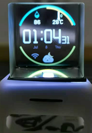
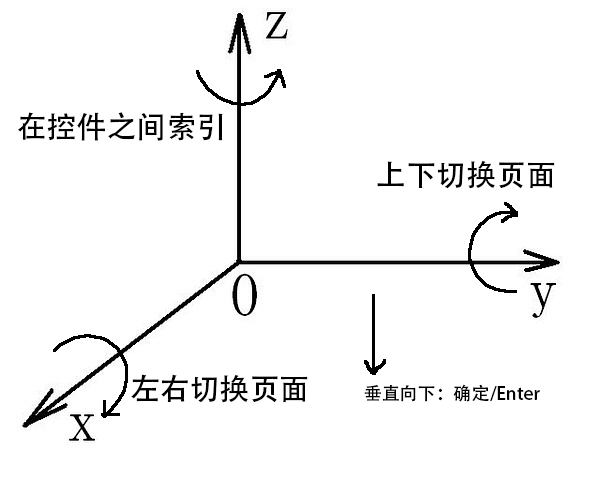

<h1 align="center"> HoloCubic--多功能透明显示屏桌面站</h1>
<p align="center">
 
</p>

## 项目说明

- 原项目地址: https://github.com/peng-zhihui/HoloCubic
- 原项目视频介绍: https://www.bilibili.com/video/BV1VA411p7MD
- 该项目基于稚辉君的项目，使用了一块分光棱镜来改变屏幕光线光路，实现了伪全息的显示效果。本项目显示设备实现了时钟、闹钟、实时天气显示、天气预报显示、多城市天气预报显示、扫码配网等功能。

<p align="center">
 
</p>

## 文件结构

```
MyCubic
├─ Circuit      电路原理图、PCB图
├─ Code         软件代码，Platformio项目文件
├─ Documents    可供查阅的文档资料
├─ Model        外壳3d打印文件
├─ Simulator    模拟器，Platformio项目文件
├─ Sources      原始图像、字体资源
├─ bin          这个文件夹需放入Sd卡中
└─ README.md
```

## 硬件打样

本项目里的电路原理图和PCB图是我参照稚辉君的电路图自己绘制的，主要是想从头走一遍这样的流程：元器件选型--元器件手册阅读--原理图绘制--PCB绘制。这是我第一个项目，以前没有接触过这些，所以自己练习了一遍，因此可能存在瑕疵。大家可以使用原项目仓库中的PCB文件进行打样，我使用了同样的引脚，所以软件代码是通用的。
> 如果使用原仓库的PCB，EN引脚的0.1uF电容需替换为1uF电容，使得下载时的上电顺序稳定，否则可能出现下载不稳定的情况

## 软件编译

软件代码基于Arduino框架，我使用VSCode的PlatformIO进行开发，有关PlatformIO请访问 https://platformio.org/platformio-ide

此外，需注意以下三点：

- esp32-pico-d4的引导程序和SD卡的IO脚存在冲突，GPIO12在上电复位时需下拉为0，让内部稳压器给板载的Flash提供3.3V电压。解决方式有两种
  - 一种是进入 `.platformio\packages\tool-esptoolpy` 文件夹然后运行以下命令，此命令将烧毁XPD_SDIO_TIEH、XPD_SDIO_FORCE和XPD_SDIO_REG 三个熔丝，内部 VDD_SDIO flash 稳压器将永久设置为 3.3 V。（不可逆）
    ``` 
    components/esptool_py/esptool/espefuse.py set_flash_voltage 3.3V 
    ```
  - 另一种是使用ESP32的GPIO交换矩阵，把这个IO口的功能转移到其它IO口上。进入`.platformio\packages\framework-arduinoespressif32\libraries\SPI\src\SPI.cpp`文件中，将以下代码中的12改为26。（会降低SPI最大速率）
    ```
      if(sck == -1 && miso == -1 && mosi == -1 && ss == -1) {
        _sck = (_spi_num == VSPI) ? SCK : 14;
        _miso = (_spi_num == VSPI) ? MISO : 12; // 需要改为26
        _mosi = (_spi_num == VSPI) ? MOSI : 13;
        _ss = (_spi_num == VSPI) ? SS : 15;
     ```
- 在 `include\network.h` 文件中定义自己的WEBKEY，本项目使用了高德开放平台的API，可以去 https://lbs.amap.com/ 免费申请
- 需要将整个`bin`文件夹放入Sd卡中

## LVGL模拟器

`Simulator`为模拟器项目文件夹，可以在windows上模拟TFT屏幕，方便控件的布局，不用每次都下载代码。在PlatformIO上使用模拟器需要安装`SDL`，请参考 https://github.com/lvgl/lv_platformio

## 3d打印外壳

3d模型我在稚辉君的模型作了一点修改，将两部分合成一部分，扩大了TypeC的口，原版口太小了，我的TypeC没法完全插入。

关于装配，棱镜与屏幕可以使用`UV胶`进行粘接，屏幕板和外壳之间可以用`热熔胶`封口固定

## 操作说明

<p align="center">
 
</p>
